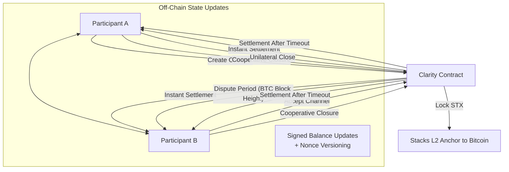

# LightningBridge – Instant Bitcoin Payment Channels

### Institutional-Grade, Trustless Payment Channels for Bitcoin on Stacks L2

---

## Overview

**LightningBridge** is a Clarity-based protocol that brings **instant, bidirectional Bitcoin payment channels** to the Stacks ecosystem. It leverages Stacks’ Bitcoin-anchored architecture to deliver **sub-second micropayments** with **cryptographic security guarantees**, enabling high-frequency, trustless settlement between parties.

By combining **atomic multisignature enforcement**, **Bitcoin block-height–based challenge periods**, and **hybrid STX/BTC settlement pathways**, LightningBridge ensures robust dispute resolution, secure unilateral exits, and cooperative finality.

Designed for **DeFi protocols, gaming platforms, content monetization, and enterprise payment rails**, LightningBridge eliminates counterparty risk while preserving Bitcoin’s decentralization and immutability.

---

## Key Features

* ⚡ **Instant micropayments** with unlimited throughput
* 🔐 **Bitcoin-compatible multisig enforcement**
* ⏱ **Dispute resolution anchored to Bitcoin block height**
* 🛡 **Clarity-optimized smart contracts with formal verifiability**
* 🤝 **Cooperative & unilateral closure mechanisms**
* 💱 **Hybrid STX/BTC settlement architecture**
* 🚨 **Emergency fund recovery for governance & upgrades**

---

## System Overview

At its core, LightningBridge operates as a **state channel manager**, maintaining off-chain payment flows with **on-chain enforcement guarantees**. Participants open a channel by depositing STX into a Clarity contract. Payments are exchanged off-chain using **signed state updates**, while the contract serves as an arbiter for:

1. **Funding** – locking assets in the channel
2. **Settlement** – cooperative closure or forced closure via dispute mechanisms
3. **Recovery** – fallback to unilateral settlement if the counterparty is unresponsive

This architecture allows applications to achieve **lightning-fast Bitcoin-anchored transactions** without congesting the blockchain.

---

## Contract Architecture

The protocol is structured into the following modules:

### 1. **Core Channel Management**

* `create-channel` → Opens a new bidirectional channel with initial deposit
* `fund-channel` → Expands channel liquidity dynamically

### 2. **Settlement Mechanisms**

* `close-channel-cooperative` → Fast, mutual closure with instant settlement
* `initiate-unilateral-close` → Starts forced closure, triggering dispute period
* `resolve-unilateral-close` → Finalizes forced closure post-dispute window

### 3. **Utilities & Validation**

* Signature validation (`verify-signature`)
* Deposit and channel ID validation
* Replay protection via nonce and message encoding

### 4. **Read-Only Functions**

* `get-channel-info` → Full channel state retrieval for monitoring/disputes

### 5. **Governance & Emergency**

* `emergency-withdraw` → Contract owner recovery in exceptional cases

---

## Data Flow

---

## Error Handling

The contract defines clear error codes to ensure safe operations:

* `ERR-NOT-AUTHORIZED` → Unauthorized caller
* `ERR-CHANNEL-EXISTS` → Duplicate channel creation attempt
* `ERR-CHANNEL-NOT-FOUND` → Channel lookup failed
* `ERR-INSUFFICIENT-FUNDS` → Invalid balance distribution
* `ERR-INVALID-SIGNATURE` → Settlement verification failed
* `ERR-CHANNEL-CLOSED` → Action on inactive channel
* `ERR-DISPUTE-PERIOD` → Dispute window not expired
* `ERR-INVALID-INPUT` → Malformed or invalid parameters

---

## Use Cases

* **DeFi protocols** – trustless STX/BTC settlement layers
* **Gaming platforms** – instant in-game micropayments
* **Content monetization** – pay-per-use streaming and publishing
* **Enterprise settlement rails** – high-frequency institutional transfers

---

## Security Considerations

* **Formal Verification Ready**: Written in Clarity for predictable execution
* **Bitcoin Anchoring**: Challenge windows enforced by `stacks-block-height`
* **Unilateral Exit Safety**: Guarantees participants can always reclaim funds
* **Emergency Governance**: Contract owner can recover funds for protocol upgrades

---

## Future Extensions

* Native BTC integration via sBTC
* Cross-chain settlement pathways
* Multi-party channels (beyond two participants)
* HTLC (Hashed Time-Lock Contract) support for trustless routing

---

## License

This project is released under the **MIT License**.
